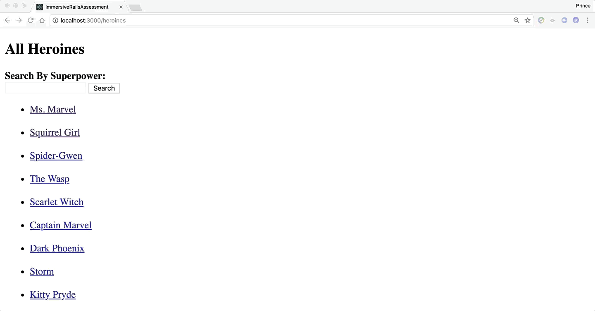

# Rails Code Challenge

It's time to put our Rails know-how to the test. Today, we are asked to build an application that will be a superheroine character creator!

## Objectives
+ MVC
+ REST
+ Request/Response Cycle
+ Form/Form Helpers
+ ActiveRecord
+ Validations

## Setup

Before you begin, fork and clone this repo, run `bundle install` and `rake db:migrate` to get started.

## The Domain

You've just been hired by 'Marvel Comics' - congratulations! The production staff wants you to make a website that will allow the fans to create [heroines, women superheroes](http://www.dictionary.com/browse/heroine). To do this, we need a way to keep track of all of the new heroines and powers that have been created by the fans.

Luckily, another developer has already started the job. We have a model for heroines and a model for powers. Once the database is seeded, visiting `/heroines` displays all of the heroines, and visiting `/powers` displays all of the powers. We just don't have a way to associate heroines with powers.

We have several different powers and each can be bestowed upon **more than one heroine**. Each heroine can only have **one power**.

## Instructions / Deliverables

Read through the instructions to get a sense of the scope of this code challenge, and then tackle them one by one.

1. Create the associations between models. You may have to alter the current schema to get your code working. If you've set up your relationships properly, you should be able to run `rake db:seed` without errors, and confirm in console that the heroines and powers have been created with the proper relations.

2. On the heroines index page, a heroine's name should link to the heroine's show page.

3. The heroine show page should include the heroine's name (eg. Kamala Khan), her super name (eg. Ms. Marvel), and her power. The power should link to the power show page.  

4. The power show page should have its name and description.

5. As a visitor to the website, I should be able to create a new heroine with her name and super name.

6. The form should also allow each heroine to be created with **only one of the existing powers**.

  

7. Make sure no two heroines have the same super name.

# BONUS TO BE COMPLETED IF EVERYTHING ELSE IS DONE

8. Add a filter to the index view of the heroines. This will allow the visitor to search for an existing power and display all the heroines with that power on the same view page.

### Hints / Tips
+ Draw your domain model and associations before you begin. You may have to alter the current schema to get your code working.
+ A child model cannot be persisted without being associated with its parent model.
+ More than one heroine can have the same power.
+ More than one heroine can have the same power.
+ More than one heroine can have the same power.
+ We want to be RESTful. What URL should show info about a particular heroine? What URL should show a form to create a heroine? What controller actions are associated?
+ If you're having a hard time implementing the filter, take a look at this http://guides.rubyonrails.org/form_helpers.html#a-generic-search-form. We are asking an input field to search for powers.
